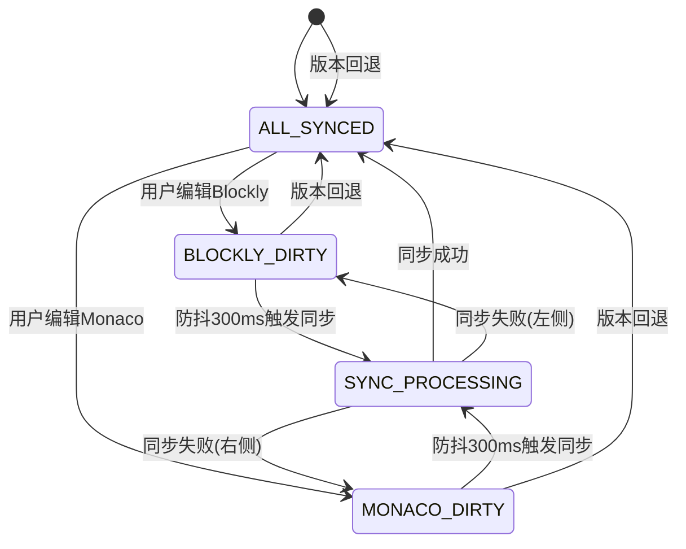

# 系统逻辑设计 - 三层双流状态模型

> **文档定位**：本文档专注于系统逻辑设计和状态控制机制，不涉及具体数据类型实现。
>
> 📋 **相关文档**：
> - 设计约束 → [核心原则](2-核心原则.md) 
> - 接口规范 → [模块契约](4-模块契约.md)
> - 具体实现 → [实施指南](5-实施指南.md)

## 💡 系统设计哲学

### 核心理念：物理不一致 → 逻辑一致
```
系统本质：将不可避免的物理不一致转化为受控的逻辑一致状态

物理现实：三层数据在内存中必然存在瞬时不同步
逻辑控制：通过状态机确保系统在任何时刻都处于可控状态
用户体验：状态透明，操作流畅，数据安全
```

### 通用架构模式（数据类型无关）
```
Blockly编辑器(UI层) ↔ JSON结构(权威层) ↔ Monaco编辑器(UI层)
```

**架构特点**：
- **数据类型无关**：适用于JSON、Expression、TypeScript等任意数据类型
- **中间结构层（JSON结构）是系统的逻辑权威源**：单一数据源，避免冲突
- **三层分离**：职责清晰，便于测试和维护
- **双向流动**：支持任意方向的编辑和同步

## 🔄 四状态模型 - 精确控制规则

### 状态定义（通用模式）
| 状态 | 数据关系 | 编辑权限 | 高亮功能 | 界面状态 |
|------|----------|----------|----------|----------|
| **ALL_SYNCED** | 三层数据一致 | 双向可编辑 | ✅ 启用 | 🟢 同步完成 |
| **BLOCKLY_DIRTY** | blockly≠json ≡ monaco | 仅Blockly可编辑 | ❌ 禁用 | 🟡 Blockly编辑中 |
| **MONACO_DIRTY** | blockly≡json ≠ monaco | 仅Monaco可编辑 | ❌ 禁用 | 🟡 Monaco编辑中 |
| **SYNC_PROCESSING** | 同步转换中 | 原编辑侧可继续编辑 | ❌ 禁用 | 🔵 同步中 |

### 状态转换表

| 转换路径 | 触发条件 | 约束 | 实现参考 |
|---|---|---|---|
| ALL_SYNCED → BLOCKLY_DIRTY | Blockly编辑 | 立即转换 | [状态管理模块](4-模块契约.md#状态管理接口) |
| ALL_SYNCED → MONACO_DIRTY | Monaco编辑 | 立即转换 | [状态管理模块](4-模块契约.md#状态管理接口) |
| BLOCKLY_DIRTY → SYNC_PROCESSING | 防抖300ms触发 | 校验数据可转换 | [时序控制](#防抖节流机制) |
| MONACO_DIRTY → SYNC_PROCESSING | 防抖300ms触发 | 校验数据可转换 | [时序控制](#防抖节流机制) |
| SYNC_PROCESSING → ALL_SYNCED | 同步成功 | 创建版本快照 | [版本管理](#版本管理系统) |
| SYNC_PROCESSING → BLOCKLY_DIRTY | 同步失败 | 回退到来源状态 | [错误处理](#错误恢复优先级) |
| SYNC_PROCESSING → MONACO_DIRTY | 同步失败 | 回退到来源状态 | [错误处理](#错误恢复优先级) |

### 状态转换图
<details>
<summary>点击查看状态转换图详情</summary>



**重要规则**：
- SYNC_PROCESSING→BLOCKLY_DIRTY/MONACO_DIRTY转换必须通过错误事件触发
- 不允许直接在状态转换图中定义这些路径
- 版本回退可以从任意状态直接回到ALL_SYNCED状态
</details>

### 核心约束（设计不变式）
<details>
<summary>点击查看系统不变式详情</summary>

```typescript
// 这些约束适用于任何数据类型的双向编辑系统
interface SystemInvariants {
  // 数据一致性约束
  dataConsistency: '非SYNC_PROCESSING状态时，至少一侧数据与中间结构一致'
  
  // 编辑权限约束  
  editingRights: '同时只允许一侧编辑（ALL_SYNCED除外）'
  
  // 用户优先约束
  userPriority: '用户操作响应 < 50ms，系统功能异步退避'
  
  // 状态透明约束
  stateTransparency: '所有状态变化必须在界面上清晰反映'
  
  // 错误恢复约束
  errorRecovery: '任何错误都有明确的恢复路径和用户指导'
}
```

这些不变式是系统设计的基石，确保了即使在复杂的异步操作环境中，系统行为也保持可预测和可靠。
</details>

## ⚡ 防抖节流机制

### 双重控制策略

⚠️ 注意：防抖300ms/节流100ms参数为不可修改的核心契约值
具体约束见[模块契约§4.5](4-模块契约.md#时序控制接口)

```typescript
// 通用的时序控制模式（不依赖具体数据类型）
interface TimingController {
  // 防抖：主要策略，决定状态转换
  debounce: {
    delay: 300,           // 300ms静止期后触发
    canTriggerTransition: true,  // 可以触发状态转换
    purpose: '决定何时开始同步过程'
  }
  
  // 节流：安全机制，提供实时反馈
  throttle: {
    interval: 100,        // 每100ms强制检查一次
    canTriggerTransition: false, // 不能触发状态转换
    purpose: '保证连续编辑时的实时反馈'
  }
}
```

### SYNC_PROCESSING编辑处理

#### 单一覆盖策略
- 新输入覆盖旧值（单一覆盖策略）：在同步过程中，用户继续编辑会触发新的编辑状态，但这些操作会被合理排队处理
- 同步完成后处理待编辑内容：优先完成当前正在进行的同步任务，然后基于最新的编辑状态重新开始同步流程

### SYNC_PROCESSING状态下的编辑替换机制
<details>
<summary>点击查看编辑替换机制详情</summary>

```typescript
// 通用的编辑替换策略
interface EditingReplacementStrategy {
  // 用户在SYNC_PROCESSING状态继续编辑时的处理
  onContinuousEditing: {
    immediateResponse: '编辑立即响应，无任何延迟',
    debounceValidation: '300ms后验证，成功则替换待处理值',
    throttleValidation: '100ms间隔提供实时反馈',
    noInterruption: '不中断当前同步过程'
  }
  
  // 替换机制的核心逻辑
  replacementLogic: {
    singlePendingValue: '只维护一个待处理值，新编辑覆盖旧值',
    syncCompletion: '当前同步完成后，处理最新的待处理内容',
    validationFirst: '只有验证通过的内容才能成为待处理值'
  }
}
```
</details>

## 🔐 数据完整性保障

### 错误恢复优先级
与[核心原则](2-核心原则.md)的"错误恢复原则"保持完全一致：
- **数据保护优先级**：用户正在编辑的内容 > 历史数据 > 系统状态

### 错误回退路径
#### STATE_RECOVERED事件触发条件
与[核心原则](2-核心原则.md)错误处理章节完全对应，触发场景包括：
1. 数据转换错误重试失败
2. 同步超时保护触发
3. 版本回滚完成
4. 状态机重置成功
5. 用户输入错误自动修正

### 版本管理系统（通用模式）
<details>
<summary>点击查看版本管理系统详情</summary>

```typescript
interface VersionManagement {
  // 版本创建规则
  versionCreation: {
    trigger: '仅在到达ALL_SYNCED状态时自动创建',
    content: '完整的三层数据快照',
    metadata: '时间戳、操作描述、数据摘要'
  }
  
  // 版本回退机制
  versionRollback: {
    atomicOperation: '原子性操作，无中间状态',
    universalRecovery: '从任意状态都可以直接回退',
    lockingStrategy: '回退时锁定所有编辑器',
    stateGuarantee: '回退后必定进入ALL_SYNCED状态'
  }
}
```

版本管理系统是错误恢复的最后一道防线，确保用户可以随时回退到之前的稳定状态。
</details>

## 🧩 技术矩阵

| 技术点 | 原则关联 | 架构位置 | 契约条款 | 实现模块 |
|---|---|---|---|---|
| 四状态模型 | 原则1,3 | 系统模型§2 | 契约§3.1 | 状态管理 |
| 防抖300ms | 原则2 | 实施指南§4 | 契约§4.5 | 时序控制 |
| 三层数据流 | 原则1,5 | 系统模型§1 | 契约§2.1 | 数据转换 |
| 版本管理 | 原则5 | 系统模型§4 | 契约§5.2 | 错误处理 |
| 单一编辑权 | 原则3 | 系统模型§2 | 契约§3.3 | 状态管理 |