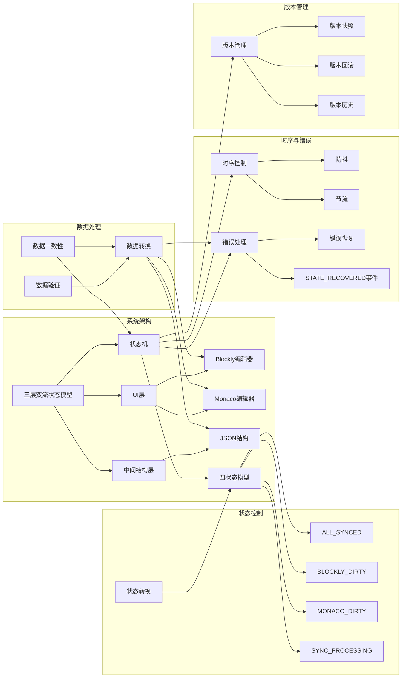
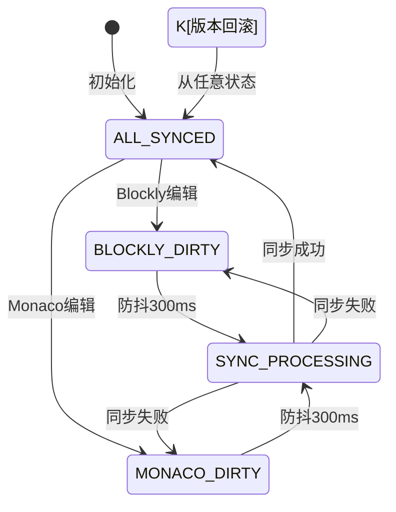

# 术语标准与概念索引 - 三层双流状态模型

> **文档定位**：本文档定义了系统中的核心术语和概念，是理解系统设计的基础参考。
>
> 📋 **相关文档**：
> - 设计原则 → [核心原则](2-核心原则.md) 
> - 系统架构 → [系统模型](3-系统模型.md)
> - 接口规范 → [模块契约](4-模块契约.md)

## 📚 核心术语定义

### 架构相关术语

#### 三层双流状态模型
**定义**：一种将UI编辑层、数据转换层和逻辑控制层分离的架构模式，支持双向数据流动和精确的状态控制。
**应用场景**：Blockly和Monaco编辑器的双向同步系统
**核心特点**：分层架构、状态驱动、双向流动、精确控制
**相关概念**：状态机、数据转换、时序控制

#### UI层
**定义**：用户界面层，包括Blockly可视化编辑器和Monaco代码编辑器。
**职责**：接收用户输入，展示数据内容，提供编辑功能
**组成**：Blockly编辑器、Monaco编辑器、状态指示器、操作按钮
**约束**：遵循单一编辑权原则

#### 中间结构层（JSON结构）
**定义**：系统的逻辑权威源，存储规范的JSON数据结构。
**职责**：作为数据转换的中间桥梁，保证数据一致性
**特点**：独立于具体UI实现，数据格式规范统一
**重要性**：系统的单一数据源，避免多源冲突

#### 状态机
**定义**：控制和管理系统状态转换的核心组件。
**职责**：维护系统状态，控制状态转换，通知状态变化
**组成**：状态定义、转换规则、状态监听器
**特性**：确定性、可预测性、可追踪性
**相关概念**：SystemState、状态转换、状态监听

#### 四状态模型
**定义**：系统中定义的四种核心状态，用于精确控制编辑和同步行为。
**组成**：ALL_SYNCED、BLOCKLY_DIRTY、MONACO_DIRTY、SYNC_PROCESSING
**用途**：控制编辑权限、同步时机、UI反馈
**重要性**：整个系统行为控制的基础

#### 数据转换引擎
**定义**：负责不同数据格式之间转换的核心组件。
**职责**：实现Blockly <-> JSON <-> Monaco之间的双向转换
**特性**：类型安全、错误处理、可扩展
**相关概念**：transformer、validator、数据类型插件

### 状态相关术语

#### SystemState
**定义**：系统状态的枚举类型，定义了系统的四种核心状态。
**取值**：ALL_SYNCED、BLOCKLY_DIRTY、MONACO_DIRTY、SYNC_PROCESSING
**用途**：作为状态机的状态标识
**核心约束**：状态转换必须遵循预定义规则

#### ALL_SYNCED状态
**定义**：三层数据完全一致的状态。
**数据关系**：Blockly ≡ JSON ≡ Monaco
**编辑权限**：双向可编辑（Blockly和Monaco均可编辑）
**UI反馈**：绿色状态指示器，无同步动画
**重要操作**：自动创建版本快照

#### BLOCKLY_DIRTY状态
**定义**：Blockly编辑器内容已修改但尚未同步的状态。
**数据关系**：Blockly ≠ JSON ≡ Monaco
**编辑权限**：仅Blockly可编辑
**UI反馈**：黄色状态指示器，无同步动画
**触发条件**：用户在Blockly编辑器中进行编辑

#### MONACO_DIRTY状态
**定义**：Monaco编辑器内容已修改但尚未同步的状态。
**数据关系**：Blockly ≡ JSON ≠ Monaco
**编辑权限**：仅Monaco可编辑
**UI反馈**：黄色状态指示器，无同步动画
**触发条件**：用户在Monaco编辑器中进行编辑

#### SYNC_PROCESSING状态
**定义**：系统正在进行数据同步的状态。
**数据关系**：同步过程中，数据可能处于不一致状态
**编辑权限**：原编辑侧可继续编辑
**UI反馈**：蓝色状态指示器，显示同步动画
**触发条件**：防抖时间到达，触发同步流程

#### 状态转换
**定义**：系统从一个状态切换到另一个状态的过程。
**触发方式**：用户操作、系统事件、定时任务
**核心约束**：必须遵循预定义的状态转换规则
**重要特性**：原子性（要么完全成功，要么完全失败）

### 数据相关术语

#### 数据转换
**定义**：将数据从一种格式转换为另一种格式的过程。
**类型**：Blockly→JSON、JSON→Blockly、Monaco→JSON、JSON→Monaco
**核心要求**：保持数据语义一致性，处理错误情况
**相关概念**：transformer、validator、数据类型插件

#### 数据一致性
**定义**：不同层数据之间保持语义上的一致状态。
**类型**：物理一致性（三层数据完全相同）、逻辑一致性（数据语义相同）
**重要性**：系统可靠性和正确性的基础
**实现方式**：状态机控制、数据转换、版本管理

#### 数据验证
**定义**：检查数据是否符合预定义格式和约束的过程。
**目的**：确保数据质量，预防错误
**实现方式**：使用JSON Schema、自定义验证函数
**发生时机**：数据输入时、数据转换前后

### 时序控制术语

#### 防抖（Debounce）
**定义**：一种控制事件触发频率的技术，在事件停止后等待一定时间再执行。
**目的**：避免频繁触发耗时操作
**配置值**：300ms（可配置）
**应用场景**：用户连续编辑后触发同步
**相关概念**：节流

#### 节流（Throttle）
**定义**：一种控制事件触发频率的技术，限制事件在一定时间内最多执行一次。
**目的**：保证用户操作的实时反馈
**配置值**：100ms（可配置）
**应用场景**：用户连续编辑时提供实时状态更新
**相关概念**：防抖

#### 时序控制
**定义**：管理和控制事件执行顺序和时机的机制。
**组成**：防抖控制、节流控制、优先级调度
**目的**：优化用户体验，提高系统性能
**核心要求**：用户操作响应 < 50ms

### 错误处理术语

#### 错误恢复
**定义**：系统从错误状态恢复到正常状态的过程。
**核心原则**：数据保护优先级（用户正在编辑的内容 > 历史数据 > 系统状态）
**触发条件**：数据转换错误、同步超时、用户取消
**实现方式**：回退到来源状态、版本回滚、手动干预

#### 错误处理
**定义**：系统识别、报告和处理错误的机制。
**组成**：错误检测、错误报告、错误恢复
**目的**：确保系统稳定性，减少用户损失
**重要特性**：可追溯性、可恢复性、用户友好性

#### STATE_RECOVERED事件
**定义**：系统从错误状态成功恢复后的事件通知。
**触发场景**：数据转换错误重试失败、同步超时保护触发、版本回滚完成、状态机重置成功、用户输入错误自动修正
**用途**：通知UI更新状态，提供用户反馈
**相关概念**：状态转换、错误处理

### 版本管理术语

#### 版本快照
**定义**：系统在某一时刻的完整数据备份。
**创建时机**：仅在ALL_SYNCED状态时自动创建
**内容**：完整的三层数据快照（Blockly、JSON、Monaco）
**用途**：支持版本回滚，保证数据安全
**相关概念**：版本历史、版本回滚

#### 版本回滚
**定义**：将系统数据恢复到之前某个版本快照的过程。
**特性**：原子操作，无中间状态
**恢复保证**：回退后必定进入ALL_SYNCED状态
**用途**：错误恢复，撤销操作
**核心约束**：回退时锁定所有编辑器，防止数据冲突

#### 版本历史
**定义**：记录系统所有版本快照的历史记录。
**存储**：按时间倒序排列
**限制**：可配置最大历史记录数
**用途**：追踪数据变更，支持版本回滚
**相关概念**：版本快照、版本回滚

## 🔗 术语关系图

### 核心概念关系图

### 状态转换关系图

## 🧩 技术矩阵

| 技术点 | 原则关联 | 架构位置 | 契约条款 | 实现模块 | 核心术语 |
|---|---|---|---|---|---|
| 四状态模型 | 原则1,3 | 系统模型§2 | 契约§3.1 | 状态管理 | SystemState、状态转换 |
| 防抖300ms | 原则2 | 实施指南§4 | 契约§4.5 | 时序控制 | 防抖、节流、时序控制 |
| 三层数据流 | 原则1,5 | 系统模型§1 | 契约§2.1 | 数据转换 | 三层双流状态模型、数据转换、数据一致性 |
| 版本管理 | 原则5 | 系统模型§4 | 契约§5.2 | 错误处理 | 版本快照、版本回滚、版本历史 |
| 单一编辑权 | 原则3 | 系统模型§2 | 契约§3.3 | 状态管理 | ALL_SYNCED、BLOCKLY_DIRTY、MONACO_DIRTY |
| 错误恢复优先级 | 原则5 | 系统模型§4 | 契约§6.1 | 错误处理 | 错误恢复、STATE_RECOVERED事件 |
| 用户操作优先 | 原则2 | 核心原则§2 | 契约§4.1 | 时序控制 | 时序控制、防抖、节流 |